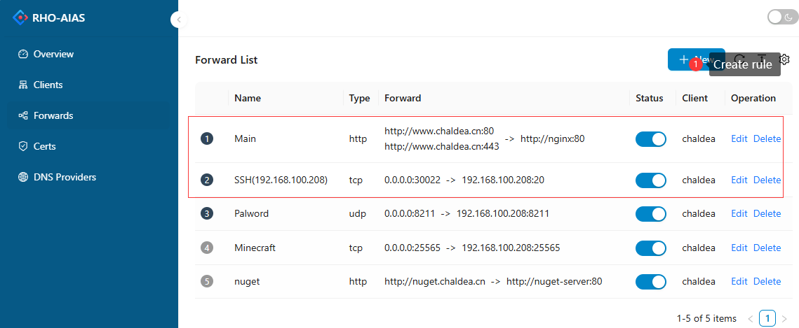

# RhoAias

RhoAias(/ˈroʊ/ - /ˈaɪ.əs/) 是一个用于反向代理和内网穿透的工具库，它既可以作为独立应用直接部署，同时也可以作为依赖库嵌入到当前 dotnet 程序中。

[English](README.md) | 简体中文

## RhoAias 特性

- 支持 http 反向代理，可以基于 location 级别转发 http 请求。
- 支持客户端无配置启动，可在 Dashboard 中动态下发转发配置。
- 支持 TCP/UDP 端口转发，可以实现 SSH 连接内网，或者暴露内网端口。
- 客户端支持 k8s-ingress，客户端监听 ingress 配置，并将入口流量转发到内网 k8s 集群。
- 支持基于 ACME 的 Https 证书申请，支持证书续期。
- 支持 Metric 监控，可接入基于 OpenTelemetry 标准的监控工具，如 Prometheus。
- 支持数据流压缩(压缩算法支持 gzip, snappy 等)

## 使用场景

RhoAias 可以用在很多场景下，下面用一组用例来让你快速了解 RhoAias 的使用场景。

#### 1.Http 请求转发

将所有公网的 http 请求依据 path 路径转发至内网对应的服务上。


#### 2.多环境转发

RhoAias 可以依据 path 将请求转发至不同的环境中。


#### 3.负载均衡

RhoAias 支持跨多个客户端的负载均衡。


**注意：单个客户端做负载均衡是没有意义的。**

#### 4.K8S-Ingress 转发

RhoAias 可以作为 Ingress Controller 部署，将所有公网请求转发至内网的指定的 k8s 集群。


#### 5.端口转发

RhoAias 可以将内网端口暴露到公网上。


## 开始使用

### 服务端 Docker 部署

需要准备一个有公网 IP 的机器，确保该机器已经安装 Docker 环境。

```yml
services:
  rhoaias-server:
    container_name: rhoaias-server
    image: registry.cn-shanghai.aliyuncs.com/chaldea/rhoaias-server
    restart: always
    network_mode: host
    environment:
      RhoAias__Server__Bridge: 8024 # 客户端连接端口
      RhoAias__Server__Http: 80 # http请求转发端口
      RhoAias__Server__Https: 443 # https请求转发端口
    volumes:
      - rhoaias_server_data:/app/data # 数据存储目录
      - rhoaias_server_certs:/app/certs # https证书存储目录

volumes:
  rhoaias_server_data:
  rhoaias_server_certs:
```

由于端口转发需要随时监听端口，所以需要将网络设置成 host 模式，如：`network_mode: host`

保存以上配置到 docker-compose.yml 文件中。执行指令：

```sh
docker compose up -d
```

容器启动后需要确认上述端口是否可以访问，如果无法访问请检查防火墙配置。

**服务器环境变量**

| 环境变量                                    | 默认值   | 说明                                    |
| ------------------------------------------- | -------- | --------------------------------------- |
| RhoAias\_\_Server\_\_Bridge                 | 8024     | 客户端连接端口，以及 Dashboard 访问端口 |
| RhoAias\_\_Server\_\_Http                   | 80       | Http 请求端口                           |
| RhoAias\_\_Server\_\_Https                  | 443      | Https 请求端口                          |
| RhoAias\_\_Dashboard\_\_UserName            | admin    | Dashboard 默认用户名                    |
| RhoAias\_\_Dashboard\_\_Password            | 123456Aa | Dashboard 默认用户密码                  |
| RhoAias\_\_Dashboard\_\_CreateDefaultUser   | true     | 是否创建默认用户                        |
| RhoAias\_\_Dashboard\_\_CreateDefaultClient | true     | 是否生成默认客户端                      |

### 生成客户端 Token

服务端启动后，打开 Dashboard(http://{public-ip}:8024) 页面。输入用户名和密码，进入 Dashboard。默认服务器会生成一个测试用的客户端，你也可以在客户端列表中手动创建。


### 部署客户端

RhoAias 提供了多种方式部署客户端，如 docker， 控制台程序， k8s-ingress 等。

#### 1.Docker 模式

在内网机器上，创建如下 docker 配置：

```yml
services:
  rhoaias-client:
    container_name: rhoaias-client
    image: registry.cn-shanghai.aliyuncs.com/chaldea/rhoaias-client
    restart: always
    environment:
      # 服务端url地址
      RhoAias__Client__ServerUrl: http://{server-ip}:8024
      # 创建客户端时生成的Token
      RhoAias__Client__Token: PCv11vMiZkigHfnzcMLTFg
```

执行以下指令后在服务端 Dashboard 中确保客户端状态显示为在线。

```sh
docker compose up -d
```

**客户端环境变量**

| 环境变量                       | 说明            |
| ------------------------------ | --------------- |
| RhoAias\_\_Client\_\_ServerUrl | 服务端地址      |
| RhoAias\_\_Client\_\_Token     | 客户端 TokenKey |

#### 2.控制台或系统服务模式

你可以在[Release](https://github.com/chaldea/rho-aias/releases)页面下载对应架构的客户端程序的二进制文件。

作为控制台程序启动：

```sh
rhoaias-client -s http://{server-ip}:8024 -t PCv11vMiZkigHfnzcMLTFg
```

| 启动参数     | 说明            |
| ------------ | --------------- |
| -s, --server | 服务端地址      |
| -t, --token  | 客户端 TokenKey |

如果你需要它作为系统服务启动：

- 在 Windows 平台, 你可以使用[nssm](https://nssm.cc/usage)
- 在 Linux 平台，你可以使用 systemd

#### 3.k8s-ingress 模式

在 k8s 集群的管理节点上，执行以下指令创建 namespace

```bash
kubectl create namespace rho-aias
```

应用 Deployment 配置文件

```bash
kubectl apply -f https://github.com/chaldea/rho-aias/blob/main/kubernetes/ingress-controller.yaml -n rho-aias
```

检查 Deployment 应用状态

```bash
kubectl get deployments
```

RhoAias 支持使用 helm 工具安装。helm-chart 位于`./kubernetes/ingress-rho-aias` 目录下。

### 创建转发规则

在 Dashboard 的转发列表页面，你可以为指定的客户端创建不同类型的转发规则，所有符合规则的请求将会转发至客户端所在的内网。



### Https 证书申请

通常我们会使用 HTTPS 正式来确保网站的安全，RhoAias 内置支持证书管理器，你可在 Dashboard 的证书管理页面申请免费的 HTTPS 证书。证书也支持自动续期。

`Let'sEncrypt` 支持单域名(如: a.sample.com)和泛域名(如: \*.sample.com)两种类型证书。泛域名证书需要 DNS 服务商提供接口支持。如果要使用泛域名，你需要在 Dashboard 的 DNS 提供商页面配置。


**NOTE: 泛域名证书是包含单域名证书，因为如果你有 DNS 服务商接口，推荐使用泛域名模式。**

## 应用集成

Rho-Aias 可以直接使用 nuget 包添加到当前项目中。

```sh
dotnet add package Chaldea.Fate.RhoAias
```

具体开发可以参考[开发文档](docs/development.md)

### Nuget 包列表

| Nuget 包                                      | 版本号                                                                                                                                                                | 说明                                                    |
| --------------------------------------------- | --------------------------------------------------------------------------------------------------------------------------------------------------------------------- | ------------------------------------------------------- |
| Chaldea.Fate.RhoAias                          | [](https://www.nuget.org/packages/Chaldea.Fate.RhoAias)                                                   | 核心包，支持反向代理和内网穿透                          |
| Chaldea.Fate.RhoAias.Acme.LetsEncrypt         | [](https://www.nuget.org/packages/Chaldea.Fate.RhoAias.Acme.LetsEncrypt)                 | ACME 证书提供器                                         |
| Chaldea.Fate.RhoAias.Authentication.JwtBearer | [](https://www.nuget.org/packages/Chaldea.Fate.RhoAias.Authentication.JwtBearer) | Jwt 认证包，客户端连接授权认证(默认客户端是 Basic 认证) |
| Chaldea.Fate.RhoAias.Compression.Snappy       | [](https://www.nuget.org/packages/Chaldea.Fate.RhoAias.Compression.Snappy)             | 数据流压缩 Snappy 实现(默认压缩使用 gzip)               |
| Chaldea.Fate.RhoAias.Dashboard                | [](https://www.nuget.org/packages/Chaldea.Fate.RhoAias.Dashboard)                               | Dashboard 管理程序                                      |
| Chaldea.Fate.RhoAias.Dns.Aliyun               | [](https://www.nuget.org/packages/Chaldea.Fate.RhoAias.Dns.Aliyun)                             | 阿里云 DNS 提供器实现                                   |
| Chaldea.Fate.RhoAias.IngressController        | [](https://www.nuget.org/packages/Chaldea.Fate.RhoAias.IngressController)               | k8s-ingress 实现                                        |
| Chaldea.Fate.RhoAias.Metrics.Prometheus       | [](https://www.nuget.org/packages/Chaldea.Fate.RhoAias.Metrics.Prometheus)             | Metric 提供器，对外提供 Metric 数据接口                 |
| Chaldea.Fate.RhoAias.Repository.Sqlite        | [](https://www.nuget.org/packages/Chaldea.Fate.RhoAias.Repository.Sqlite)               | 仓储 Sqlite 实现(默认数据存储使用 InMemoryDb )          |

## 贡献

[](https://github.com/chaldea/rho-aias/pulls)

如果你想要贡献，随时欢迎你提交 [Pull Request](https://github.com/chaldea/rho-aias/pulls), 或者返回 Bug [Bug Report](https://github.com/chaldea/rho-aias/issues/new)。
