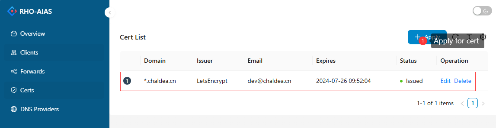

# RhoAias

RhoAias(/ˈroʊ/ - /ˈaɪ.əs/) is a library for reverse proxy and intranet traversal, that can be deployed directly as a standalone application or embedded as a dependency library in your dotnet application.

English | [简体中文](README-zh_CN.md)

## Features

- Support `HTTP` reverse proxy, which can forward requests based on the location level.
- The client can be started without configuration, and the configuration can be delivered from the server dashboard
- Support `TCP`/`UDP` port forwarding, which can be SSH connected to the private network
- Support k8s-ingress. The client can be deployed as a k8s-ingress so that ingress traffic can be forwarded to the intranet k8s cluster.
- Support ACME-based HTTPS certificate and certificate renewal
- Support `Metrics` monitoring, which can be connected to OpenTelemetry-based monitoring tools, such as `Prometheus`
- Support data stream compression (compression algorithm supports gzip, snappy, etc.)
- Support `WAF`(web application firewall), which can defend against script and bot attacks

## Usage Scenario

RhoAias can be used in many scenarios, and the following is a set of use case diagrams to quickly understand the use cases of RhoAias.

#### 1.HTTP request forwarding

Forward all HTTP requests from the public network to the intranet by the paths.


#### 2.Multiple ENV forwarding

RhoAias can forward requests to different `ENV` servers by the paths.


#### 3.Load Balancing

RhoAias supports load balancing across clients.


**NOTE: Load balancing for a single client doesn't make sense.**

#### 4.K8S-Ingress

RhoAias client can be deployed as a k8s-ingress.


#### 5.Port forwarding

RhoAias can expose internal network ports to the public.


## Get Started

### Server Deployment

You need to prepare a machine with a public IP address and make sure that the machine has the Docker environment installed.

```yml
services:
  rhoaias-server:
    container_name: rhoaias-server
    image: chaldea/rhoaias-server
    restart: always
    network_mode: host
    environment:
      RhoAias__Server__Bridge: 8024 # Client connection port
      RhoAias__Server__Http: 80 # HTTP request forwarding port
      RhoAias__Server__Https: 443 # HTTPS request forwarding port
    volumes:
      - rhoaias_server_data:/app/data # Data store directory
      - rhoaias_server_certs:/app/certs # HTTPS cert store directory

volumes:
  rhoaias_server_data:
  rhoaias_server_certs:
```

Due to port forwarding requires listening on any port, so you need to enable the host network mode like `network_mode: host`.

Save that configuration to `docker-compose.yml`,then exec

```sh
docker compose up -d
```

Determine that the ports on the docker container are reachable, If the port is unreachable, check your firewall configuration.

**Server Environment Variables**

| Variable Name                               | Default Value | Description                                                |
| ------------------------------------------- | ------------- | ---------------------------------------------------------- |
| RhoAias\_\_Server\_\_Bridge                 | 8024          | The client connection port, and the Dashboard access port. |
| RhoAias\_\_Server\_\_Http                   | 80            | HTTP request port.                                         |
| RhoAias\_\_Server\_\_Https                  | 443           | HTTPS request port.                                        |
| RhoAias\_\_Dashboard\_\_UserName            | admin         | Dashboard default username.                                |
| RhoAias\_\_Dashboard\_\_Password            | 123456Aa      | Dashboard default password.                                |
| RhoAias\_\_Dashboard\_\_CreateDefaultUser   | true          | Whether to create a default user.                          |
| RhoAias\_\_Dashboard\_\_CreateDefaultClient | true          | Whether to generate a default client key.                  |

### Generate Client Token Key

After the server starts, enter the Dashboard(http://{public-ip}:8024) with the default username and password. The dashboard will auto generate a default client key, which you can also manually create in the client list page.


### Client Deployment

RhoAias provides a variety of client deployment methods, such as docker, service, k8s-ingress etc.

#### 1.Docker Mode

Create a docker configuration file `docker-compose.yml` on your intranet machine.

```yml
services:
  rhoaias-client:
    container_name: rhoaias-client
    image: chaldea/rhoaias-client
    restart: always
    environment:
      # your public server url address
      RhoAias__Client__ServerUrl: http://{server-ip}:8024
      # The token key that you created on the Dashboard
      RhoAias__Client__Token: PCv11vMiZkigHfnzcMLTFg
```

Then execute the command and ensure the client's status on the server dashboard page is online.

```sh
docker compose up -d
```

**Client Environment Variables**

| Variable Name                  | Description         |
| ------------------------------ | ------------------- |
| RhoAias\_\_Client\_\_ServerUrl | Server url address. |
| RhoAias\_\_Client\_\_Token     | Client `TokenKey`   |

#### 2.Console/Service Mode

You can download the client binary program on the [Release](https://github.com/chaldea/rho-aias/releases) page.

Runs as console:

```sh
rhoaias-client -s http://{server-ip}:8024 -t PCv11vMiZkigHfnzcMLTFg
```

| Startup Parameters | Description         |
| ------------------ | ------------------- |
| -s, --server       | Server url address. |
| -t, --token        | Client `TokenKey`   |

If you want to run the client as a system service:

- On the windows, you can use [nssm](https://nssm.cc/usage)
- On the linux, you can use systemd

#### 3.K8S-Ingress Mode

In your K8s cluster, create a namespace:

```bash
kubectl create namespace rho-aias
```

Apply the deployment configuration file.

```bash
kubectl apply -f https://github.com/chaldea/rho-aias/blob/main/kubernetes/ingress-controller.yaml -n rho-aias
```

Check if the Deployment was created.

```bash
kubectl get deployments
```

RhoAias can be installed via the helm tool, and the chart is located in the `./kubernetes/ingress-rho-aias` directory.

### Generate forwarding rule

In the forwarding list of the Dashboard, you can create different types of forwarding rules for a specified client, and all requests that meet the rules will be forwarded to the intranet where the client is located.


### Generate HTTPS certificate

Normally, a website requires an HTTPS certificate to keep the site secure. RhoAias has a built-in https certificate manager, you can apply for a free https certificate based on the `ACME` protocol. The certificate will be automatically renewed upon expiration.

`Let'sEncrypt` supports both `single-domain`(eg: a.sample.com) and `wildcard domain`(eg: \*.sample.com) certificates. A wildcard domain certificate must be supported by DNS provider. When you apply for a wildcard domain certificate, you need to provide the configuration of the DNS provider.



**NOTE: Wildcard domain certificate include single-domain certificate, and if you have a DNS provider API, we recommend that you use wildcard domain certificate.**

## Development

RhoAias can be added directly to the current project as a nuget package.

```sh
dotnet add package Chaldea.Fate.RhoAias
```

For details, please refer to the [development documentation](docs/development.md).

### Nuget packages

| Package Name                                  | Build Version                                                                                                                                                         | Description                                            |
| --------------------------------------------- | --------------------------------------------------------------------------------------------------------------------------------------------------------------------- | ------------------------------------------------------ |
| Chaldea.Fate.RhoAias                          | [](https://www.nuget.org/packages/Chaldea.Fate.RhoAias)                                                   | Core package for reverse proxy and intranet traversal. |
| Chaldea.Fate.RhoAias.Acme.LetsEncrypt         | [](https://www.nuget.org/packages/Chaldea.Fate.RhoAias.Acme.LetsEncrypt)                 | ACME provider package for HTTPS certificate.           |
| Chaldea.Fate.RhoAias.Authentication.JwtBearer | [](https://www.nuget.org/packages/Chaldea.Fate.RhoAias.Authentication.JwtBearer) | JWT certificate package for client connections         |
| Chaldea.Fate.RhoAias.Compression.Snappy       | [](https://www.nuget.org/packages/Chaldea.Fate.RhoAias.Compression.Snappy)             | Snappy compression algorithm package for data stream.  |
| Chaldea.Fate.RhoAias.Dashboard                | [](https://www.nuget.org/packages/Chaldea.Fate.RhoAias.Dashboard)                               | Dashbod api and static web assets package.             |
| Chaldea.Fate.RhoAias.Dns.Aliyun               | [](https://www.nuget.org/packages/Chaldea.Fate.RhoAias.Dns.Aliyun)                             | DNS service provider for Aliyun.                       |
| Chaldea.Fate.RhoAias.IngressController        | [](https://www.nuget.org/packages/Chaldea.Fate.RhoAias.IngressController)               | k8s-ingress controller package.                        |
| Chaldea.Fate.RhoAias.Metrics.Prometheus       | [](https://www.nuget.org/packages/Chaldea.Fate.RhoAias.Metrics.Prometheus)             | Metric API package for prometheus.                     |
| Chaldea.Fate.RhoAias.Repository.Sqlite        | [](https://www.nuget.org/packages/Chaldea.Fate.RhoAias.Repository.Sqlite)               | Repository package for sqlite.                         |

## Contributing

[](https://github.com/chaldea/rho-aias/pulls)

If you would like to contribute, feel free to create a [Pull Request](https://github.com/chaldea/rho-aias/pulls), or give us [Bug Report](https://github.com/chaldea/rho-aias/issues/new).
