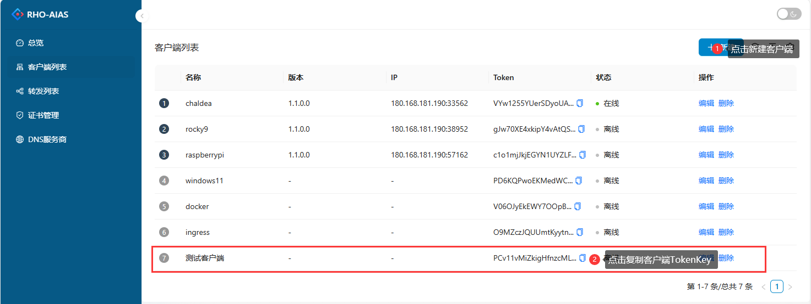
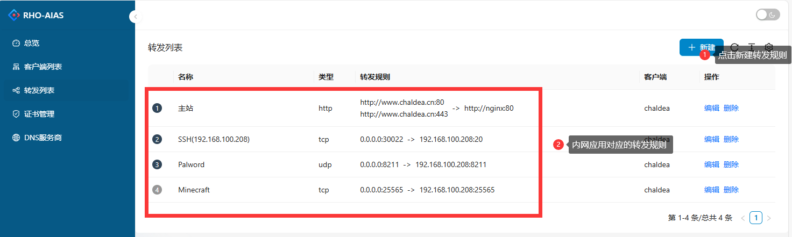
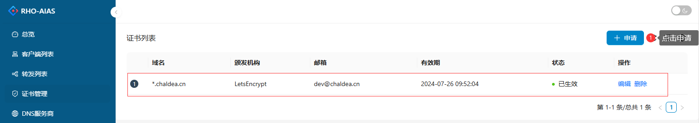

# Rho-Aias

Rho-Aias 是一个用于反向代理和内网穿透的工具库，它既可以作为独立应用直接部署，同时也可以作为依赖库嵌入到当前 dotnet 程序中。

## Rho-Aias 特性

- 支持 http 反向代理，同时支持 Location 级别的内网转发。
- 支持客户端无配置启动，可在 Dashboard 中动态下发转发规则配置。
- 支持 TCP/UDP 端口转发，可以实现 SSH 连接内网，或者暴露内网端口。
- 客户端支持 k8s-ingress，客户端监听 ingress 配置，并将入口流量转发到内网 k8s 集群。
- 支持基于 ACME 的 Https 证书申请，支持证书续期。
- 支持 Metric 监控，可接入基于 OpenTelemetry 标准的监控工具，如 Prometheus。
- 支持数据流压缩(压缩算法支持 gzip, snappy 等)

## 使用场景

### Http 请求转发

将所有公网的 http 请求依据 path 路径转发至内网对应的服务上。


### K8S-Ingress 转发

将所有公网请求转发至内网的指定的 k8s 集群。


## 开始使用

### 服务端 Docker 部署

需要准备一个有公网 IP 的机器，确保该机器已经安装 Docker 环境。

```yml
services:
  rhoaias-server:
    container_name: rhoaias-server
    image: chaldea/rhoaias-server
    restart: always
    network_mode: host
    environment:
      RhoAias__Server__Bridge: 8024 # 客户端连接端口
      RhoAias__Server__Http: 80 # http请求转发端口
      RhoAias__Server__Https: 443 # https请求转发端口
    volumes:
      - rhoaias_server_data:/app/data # 数据存储目录
      - rhoaias_server_certs:/app/certs # https证书存储目录

volumes:
  rhoaias_server_data:
  rhoaias_server_certs:
```

复制以上配置到 docker-compose.yml 文件中。执行指令：

```sh
docker compose up -d
```

服务器环境参数配置表

| 环境变量                                    | 默认值   | 说明                                    |
| ------------------------------------------- | -------- | --------------------------------------- |
| RhoAias\_\_Server\_\_Bridge                 | 8024     | 客户端连接端口，以及 Dashboard 访问端口 |
| RhoAias\_\_Server\_\_Http                   | 80       | Http 请求端口                           |
| RhoAias\_\_Server\_\_Https                  | 443      | Https 请求端口                          |
| RhoAias\_\_Dashboard\_\_UserName            | admin    | Dashboard 默认用户名                    |
| RhoAias\_\_Dashboard\_\_Password            | 123456Aa | Dashboard 默认用户密码                  |
| RhoAias\_\_Dashboard\_\_CreateDefaultUser   | true     | 是否创建默认用户                        |
| RhoAias\_\_Dashboard\_\_CreateDefaultClient | true     | 是否生成默认客户端                      |

### 生成客户端 Token

服务端启动后，打开 Dashboard 页面，[http://{公网 IP}:8024]()。输入用户名和密码，进入 Dashboard。默认服务器会生成一个测试用的客户端，你也可以在客户端列表中手动创建。


### 启动客户端

#### 方法一(Docker 模式)

在内网机器上，创建如下启动配置：

```yml
services:
  rhoaias-client:
    container_name: rhoaias-client
    image: chaldea/rhoaias-client
    restart: always
    environment:
      # 公网IP或域名，确保8024端口可以正常对外访问
      RhoAias__Client__ServerUrl: http://{公网IP}:8024
      # 创建客户端时生成的Token
      RhoAias__Client__Token: PCv11vMiZkigHfnzcMLTFg
```

执行以下指令后刷新 Dashboard 客户端列表，状态显示在线表示客户端连接成功。

```sh
docker compose up -d
```

Docker 启动参数说明

| 环境变量                       | 说明            |
| ------------------------------ | --------------- |
| RhoAias\_\_Client\_\_ServerUrl | 服务端地址      |
| RhoAias\_\_Client\_\_Token     | 客户端 TokenKey |

#### 方法二(二进制程序模式)

你可以在[Release](https://github.com/chaldea/rho-aias/releases)页面下载对应架构的客户端程序的二进制文件。

```sh
rhoaias-client -s http://{公网IP}:8024 -t PCv11vMiZkigHfnzcMLTFg
```

使用以上指令可以直接启动客户端。

| 启动参数     | 说明            |
| ------------ | --------------- |
| -s, --server | 服务端地址      |
| -t, --token  | 客户端 TokenKey |

#### 方法三(k8s-ingress 模式)

你可以直接使用 kubernetes 目录下提供的[ingress-controller.yaml](./kubernetes/ingress-controller.yaml)部署文件。或者使用 helm 安装。helm-chart 位于`./kubernetes/ingress-rho-aias` 目录下。

### 创建转发规则

在 Dashboard 的转发列表中，创建 http 转发，即可将指定的请求转发至内网指定的服务上。



### Https 证书申请

对于建站，通常都需要 Https 证书来保证网站安全。Rho-Aias 支持 ACME 免费 https 证书。只需要在证书管理页面申请即可。

其中颁发机构 LetsEncrypt 支持单域名(a.sample.com)和泛域名(\*.sample.com)证书。其中泛域名证书需要通过 DNS 服务商验证。因此需要提供 DNS 服务商配置。

**NOTE:** 一般情况下泛域名证书申请方式也可以申请普通的单域名证书。如果有DNS服务商接口，推荐优先使用泛域名申请方式。



## 嵌入应用

Rho-Aias 可以直接使用 nuget 包添加到当前项目中。

```sh
dotnet add package Chaldea.Fate.RhoAias
```

具体开发可以参考[开发文档](./docs/develop.md)

### Nuget 包列表

| Nuget 包                                      | 版本号                                                                                                                                                                | 说明                                                    |
| --------------------------------------------- | --------------------------------------------------------------------------------------------------------------------------------------------------------------------- | ------------------------------------------------------- |
| Chaldea.Fate.RhoAias                          | [](https://www.nuget.org/packages/Chaldea.Fate.RhoAias)                                                   | 核心包，支持代理和穿透功能                              |
| Chaldea.Fate.RhoAias.Acme.LetsEncrypt         | [](https://www.nuget.org/packages/Chaldea.Fate.RhoAias.Acme.LetsEncrypt)                 | ACME 证书提供器                                         |
| Chaldea.Fate.RhoAias.Authentication.JwtBearer | [](https://www.nuget.org/packages/Chaldea.Fate.RhoAias.Authentication.JwtBearer) | Jwt 认证包，客户端连接授权认证(默认客户端是 Basic 认证) |
| Chaldea.Fate.RhoAias.Compression.Snappy       | [](https://www.nuget.org/packages/Chaldea.Fate.RhoAias.Compression.Snappy)             | 数据流压缩 Snappy 实现(默认压缩使用 gzip)               |
| Chaldea.Fate.RhoAias.Dashboard                | [](https://www.nuget.org/packages/Chaldea.Fate.RhoAias.Dashboard)                               | Dashboard 管理程序                                      |
| Chaldea.Fate.RhoAias.Dns.Aliyun               | [](https://www.nuget.org/packages/Chaldea.Fate.RhoAias.Dns.Aliyun)                             | 阿里云 DNS 提供器实现                                   |
| Chaldea.Fate.RhoAias.IngressController        | [](https://www.nuget.org/packages/Chaldea.Fate.RhoAias.IngressController)               | k8s-ingress 实现                                        |
| Chaldea.Fate.RhoAias.Metrics.Prometheus       | [](https://www.nuget.org/packages/Chaldea.Fate.RhoAias.Metrics.Prometheus)             | Metric 提供器，对外提供 Metric 数据接口                 |
| Chaldea.Fate.RhoAias.Repository.Sqlite        | [](https://www.nuget.org/packages/Chaldea.Fate.RhoAias.Repository.Sqlite)               | 仓储 Sqlite 实现(默认数据存储使用 InMemoryDb )          |

## 贡献

- 使用遇到问题可以通过 issues 反馈
- 项目处于开发阶段，还有很多待完善的地方，如果可以贡献代码，请提交 PR
